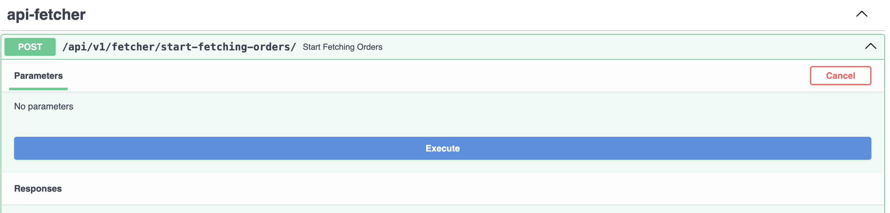

# APIOrderFetcher
Система на FastAPI для асинхронной загрузки и обработки данных о заказах и продажах (выкупах) с использованием API маркетплейса. Система выполняет запросы к API каждые 30 минут, сохраняет полученные данные в базу данных и генерирует Excel-файл с новыми заказами и продажами, отправляя его в Telegram-бот.

### Технические требования:

1. **Используемые фреймворки и библиотеки**:
    - `aiohttp` или `httpx` для асинхронных HTTP запросов.
    - `aiogram` для создания и управления Telegram-ботом.
    - `asyncio` для организации асинхронного кода.
    - `pandas` для обработки данных и формирования Excel-файлов.
    - `SQLAlchemy` (асинхронный вариант, если доступен) для взаимодействия с базой данных.
2. **База данных**:
    - Любая совместимая SQL база данных (например, PostgreSQL или SQLite), поддерживающая асинхронный доступ.

## Установка
Прежде чем вы запустите приложения Fast API и Телеграм Бот, вам необходимо установить необходимые пакеты Python. Этот проект использует `pip` для управления пакетами.

### Требования:
- Python 3.12
- pip
- Virtual environment
- Предварительная созданная База Данных `api_fetcher` в PostgreSQL
- .env файл со всеми необходимыми переменными окружения

### Настройка:
Рекомендуется использовать виртуальную среду, чтобы разделить зависимости, необходимые для разных проектов, и предотвратить конфликты.
Для создания и активации виртуальной среды вы можете использовать следующие команды:

#### Для Unix/macOS:
```sh
# Перейдите к корневой папке проекта
cd APIOrderFetcher

# Создайте виртуальное окружение
python3 -m venv venv

# Активируйте виртуальное окружение
source venv/bin/activate
```

#### Для Windows:
```sh
# Перейдите к корневой папке проекта
cd APIOrderFetcher

# Создайте виртуальное окружение
python3 -m venv venv

# Активируйте виртуальное окружение
.\venv\Scripts\Activate.ps1
```

### Установка зависимостей

Находясь в виртуальном окружении, установите все зависимости для проекта:
```sh
cd APIOrderFetcher
pip install -r requirements.txt
```

### Запуск миграции

Запустите миграции исполнив следующую команду:
```sh
cd APIOrderFetcher
cd src
alembic upgrade head
```

### Запуск приложения FastAPI

```sh
cd APIOrderFetcher
cd src
uvicorn main:app --reload
```
Где вы получите следующий адрес для запуска http://127.0.0.1:8000/

Вы можете посетить следующий адрес для получения документации Swagger http://127.0.0.1:8000/docs


## Получения заказов - Orders
Для старта запуска получения всех заказов, вы должны будете запустить через Swagger документацию,
который будет через каждые 30 минут отправлять запрос:




Вы также можете отправить следующий curl запрос для получения всех заказов:
```sh
curl -X 'POST' \
  'http://127.0.0.1:8000/api/v1/fetcher/start-fetching-orders/' \
  -H 'accept: application/json' \
  -d ''
```
**После чего вы можете на консоле заметить следующий результат, где отображены:**
- Результат успешного получения ответа
- Результат успешного сохранения в БД всех новых заказов
- Результат успешной генерации нового Excel файла заказов


**Сгенерированный Excel файл:**
Сгенерированные Excel файл вы можете найти по пути `src/app/excel_data/`


## Получения продаж - Sales
Для старта запуска получения всех продаж, вы должны будете запустить через Swagger документацию,
который будет через каждые 30 минут отправлять запрос:


Вы также можете отправить следующий curl запрос для получения всех продаж:
```sh
curl -X 'POST' \
  'http://127.0.0.1:8000/api/v1/fetcher/start-fetching-sales/' \
  -H 'accept: application/json' \
  -d ''
```
**После чего вы можете на консоле заметить следующий результат, где отображены:**
- Результат успешного получения ответа
- Результат успешного сохранения в БД всех новых продаж
- Результат успешной генерации нового Excel файла продаж


**Сгенерированный Excel файл:**
Сгенерированные Excel файл вы можете найти по пути `src/app/excel_data/`


# Telegram BOT
### Запуск телеграм бота

Находясь в виртуальном окружении запустите в паралельном терминале следующие команды:
```sh
cd APIOrderFetcher
cd src/telegram_bot
python3 fetcher_bot.py
```
После чего вы можете перейти по следующему адресу для теста Телеграм Бота:
https://t.me/orders_sales_bot

После запуска телеграм бот и отправки команды `/getfile` вы получите последние Excel файлы по продажам и заказам:

